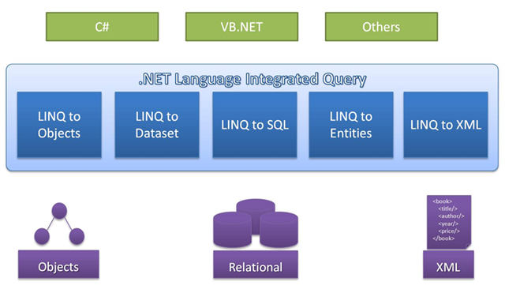
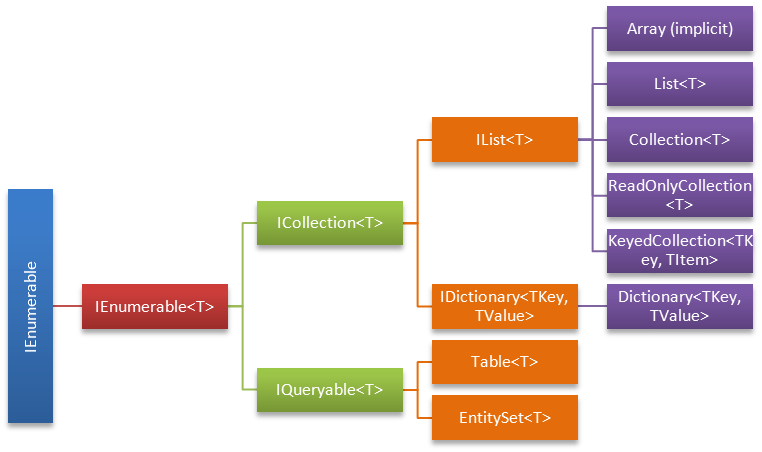

- title : C# LINQ part 1
- description : C# LINQ part 1
- author : Alex Aza
- theme : league
- transition : default

***
## C# course
#### Lecture 10
# LINQ part 1

***
## Agenda
- explanation, motivation
- LINQ & collections (needs of LINQ while working with collections)
- extension methods in LINQ context
- syntax forms
- LINQ to Objects
- understanding var and IEnumerable in LINQ context
- functional programming and lambda in context

***
##What is LINQ?
- stands for “Language INtegrated Query”
- is a set of features that extends powerful query capabilities to the language syntax of C# and Visual Basic 
- introduces standard, easily-learned patterns for querying and updating data

---
##What is LINQ?
- the technology can be extended to support potentially any kind of data store.
- Visual Studio includes LINQ provider assemblies that enable the use of LINQ with 
    - .NET Framework collections 
    - SQL Server databases 
    - ADO.NET Datasets
    - XML documents


  - [LINQ MSDN](http://msdn.microsoft.com/en-us/netframework/aa904594.aspx)
  - [Dixin's blog series](http://weblogs.asp.net/dixin/linq-via-csharp)

***
##Motivation
#####LINQ to Objects
Suppose you have a data source:

	[lang=cs]
	int[] source = { 0, -5, 12, -54, 5, -67, 3, 6 };


<div data-markdown class="fragment" data-fragment-index="1">
you need **to find** positive integers: 
</div>

<div class="fragment" data-fragment-index="1">
	
	[lang=cs]
	{ 12, 5, 3, 6 };

</div>

<div data-markdown class="fragment" data-fragment-index="2">
and **to sort** them from larger to smaller
</div>
<div class="fragment" data-fragment-index="2">

	[lang=cs]
	{ 12, 6, 5, 3 };
</div>

***
###C# 2.0:
<div class="fragment">

```cs
List<int> results = new List<int>();
foreach (var i in source)
{
    if (i > 0)
    {
        results.Add(i);
    }
}

results.Sort((x1, x2) => x2 - x1);
```

</div>

***
###Syntax forms

<div class="fragment">
Fluent or query methods sytax:

	[lang=cs]
	var results = source.Where(i => i > 0)
	                    .OrderByDescending(i => i);
</div>

<div class="fragment">
Query expression syntax:
	
	[lang=cs]
	var results = from i in source
              	  where i > 0
                  orderby i descending
                  select i;

</div>

***
###LINQ to SQL
We can query SQL database without changing query code

<div class="fragment">
fluently

```cs
database.Products
	    .Where(p => p.Category.CategoryName == "Beverages")
	    .Select(p => new Product
	    {
	        ProductName = p.ProductName,
	        UnitPrice = p.UnitPrice
	    });
```
</div>

<div class="fragment">
or with an expression

```cs
from product in database.Products
where product.Category.CategoryName == "Beverages"
select new Product
{
	ProductName = product.ProductName,
	UnitPrice = product.UnitPrice
};
```
</div>

***

###One way to query different data sources
#####LINQ to Wikipedia

```cs

wiki.Query.categorymembers()
    .Where(c => c.title == "Category:Mammals of Indonesia")
    .Select(c => c.title)
    .ToEnumerable();

```

OR

```cs

(from cm in wiki.Query.categorymembers()
 where cm.title == "Category:Mammals of Indonesia"
 select cm.title)
.ToEnumerable();

```

***
###Infrastructure of LINQ


***
###LINQ providers
|   |   |   |   |   |
|---|---|---|---|---|
|[LINQ to Amazon]|[LINQ to Indexes]|[LINQ To Geo]|[LINQ to LDAP]|[LINQ to Excel]
|[LINQ to Active Directory]|[LINQ to LLBLGen Pro]|[LINQ to Expressions (MetaLinq)]|[LINQ to Lucene]|
|[LINQ to Facebook]|[LINQ to JSON]|[LINQ Extender]|[LINQ to Metaweb(freebase)]|[LINQ to Flickr]

[LINQ to Amazon]: http://weblogs.asp.net/fmarguerie/archive/2006/06/26/Introducing-Linq-to-Amazon.aspx
[LINQ to Indexes]: http://i4o.codeplex.com/releases/view/3519
[LINQ To Geo]: http://linqtogeo.codeplex.com/
[LINQ to LDAP]: http://community.bartdesmet.net/blogs/bart/archive/2007/04/05/the-iqueryable-tales-linq-to-ldap-part-0.aspx
[LINQ to Excel]: http://xlslinq.codeplex.com/
[LINQ to Active Directory]: http://linqtoad.codeplex.com/
[LINQ to LLBLGen Pro]: http://weblogs.asp.net/fbouma/beta-of-linq-to-llblgen-pro-released
[LINQ to Expressions (MetaLinq)]: http://metalinq.codeplex.com/
[LINQ to Lucene]: http://linqtolucene.codeplex.com/
[LINQ to JSON]: http://james.newtonking.com/archive/2008/02/11/linq-to-json-beta
[LINQ Extender]: http://www.codeplex.com/LinqExtender
[LINQ to Metaweb(freebase)]: http://metawebtolinq.codeplex.com/
[LINQ to Flickr]: http://www.codeplex.com/LINQFlickr
[LINQ to Facebook]: https://github.com/assaframan/FacebookLinq2
---
|   |   |   |   |
|---|---|---|---|
|[LINQ over C# project]|[LINQ to NHibernate]|[LINQ to SimpleDB]|[LINQ to Streams]
|[LINQ to CRM]|[LINQ to JavaScript]|[LINQ to XtraGrid]|[LINQ to MySQL, Oracle and PostgreSql (DbLinq)]
|[LINQ to Opf3]|[LINQ to WMI]|[LINQ to WebQueries]|[LINQ to Sharepoint]
|[LINQ to Google]|[LINQ to Parallel (PLINQ)]|[LINQ to RDF Files]|

[LINQ over C# project]: http://www.codeplex.com/LinqOverCSharp
[LINQ to NHibernate]: http://ayende.com/blog/2227/implementing-linq-for-nhibernate-a-how-to-guide-part-1
[LINQ to SimpleDB]: http://linqtosimpledb.codeplex.com/
[LINQ to Streams]: http://slinq.codeplex.com/
[LINQ to CRM]: http://linqtocrm.codeplex.com/
[LINQ to JavaScript]: http://www.codeplex.com/JSLINQ
[LINQ to XtraGrid]: http://cs.rthand.com/blogs/blog_with_righthand/archive/2008/02/23/LINQ-to-XtraGrid.aspx
[LINQ to MySQL, Oracle and PostgreSql (DbLinq)]: http://dblinq.codeplex.com/
[LINQ to Opf3]: https://opf3.codeplex.com/
[LINQ to WMI]: http://linq2wmi.codeplex.com/
[LINQ to WebQueries]: http://blogs.msdn.com/b/hartmutm/archive/2006/06/12/628382.aspx
[LINQ to Sharepoint]: http://linqtosharepoint.codeplex.com/
[LINQ to Google]: http://glinq.codeplex.com/
[LINQ to Parallel (PLINQ)]: https://msdn.microsoft.com/en-us/library/dd997425(v=vs.110).aspx
[LINQ to RDF Files]: http://blogs.msdn.com/b/hartmutm/archive/2006/07/24/677200.aspx

***
###Key benefits
- Independent to data source
- Strong typing
- Query compilation
- Deferred execution

***
###What makes LINQ the way it is?
- Automatic Property
- Object Initializer And Collection Initializer
- Type Inference
- Anonymous Type
- Extension Method
- Lambda Expression
- Query Expression

***

###LINQ and collections


***

###Extension methods in LINQ context
How horrible it looks without extension methods:

```cs
IEnumerable<string> query =
  Enumerable.Select(
    Enumerable.OrderBy(
      Enumerable.Where(
        names, n => n.Contains("a")
      ), n => n.Length
    ), n => n.ToUpper()
  );
```

<div class="fragment">
But with them:

```cs
IEnumerable<string> query = names.Where(n => n.Contains("a"))
                                 .OrderBy(n => n.Length)
                                 .Select(n => n.ToUpper());

```
</div>

***
###Extension methods in LINQ context
It could be even readable like this:

```cs
var period = 8.October(2015).To(DateTime.Today)
                            .Step(1.Days())
                            .Select(d => d.Date);

foreach (DateTime day in period)
{
    Console.WriteLine(day);
}

```

[FIDDLE](https://dotnetfiddle.net/6PHz25)

***
###Query expression vs fluent syntax
Fluent syntax is shorter with simple where:

```cs
var adults = people.Where(person => person.Age >= 18);
```

vs

```cs
var adults = from person in people
             where person.Age >= 18
             select person;
```

---
###Query expression vs fluent syntax
Query expressions shine with joins:

```cs
from defect in SampleData.AllDefects
join subscription in SampleData.AllSubscriptions
  on defect.Project equals subscription.Project
select new { defect.Summary, subscription.EmailAddress };
```

vs

```cs
SampleData.AllDefects.Join(SampleData.AllSubscriptions, 
                defect => defect.Project,
                subscription => subscription.Project,
                (defect, subscription) => new
                {
                    defect.Summary,
                    subscription.EmailAddress
                });

```

---

###Query expression vs fluent syntax
And ordering:

```cs
orderby item.Rating descending, item.Price, item.Name
```

instead of:

```cs
.OrderByDescending(item => item.Rating)
.ThenBy(item => item.Price)
.ThenBy(item => item.Name);
```

---

###Query expression vs fluent syntax
But bear in mind that you cannot write everything in query expressions

```cs
(from product in SampleData.AllProducts
 where product.Category.CategoryName == "Beverages"
 orderby product.ProductName
 select product) // Query expression cannot do pagination.
.Skip(50)       // So it has to be mixed with query methods.
.Take(10);
```

---

###Query expression == fluent sytax
From compiler perspective query expressions are just syntactic sugar and it always translates them into method calls

For example following code

```cs
from person in people
where person.Age >= 18
select person;
```

<div class="fragment">
will be translated to 

```cs

var adults = people.Where(person => person.Age >= 18);

```
</div>

<div class="fragment">
It is the same as preprocessing (if it's familiar to you)
</div>

***

###IEnumerable helps to LINQ to rock and roll

LINQ query can produce one of two results:

enumeration

```cs
IEnumerable<int> res = from s in sequance
                       where s > 3
                       select s;
```

scalar (statistic)

```cs
int res = (from s in sequance
          where s > 3
          select s).Count();
```

***

### LINQ to Objects

Subset of LINQ which 
- is executed in memory 
- with any .NET collection which implements IEnumerable interface 
- without any intermediate provider such as LINQ to SQL or LINQ to XML

***

###Why use VAR in LINQ context
Always use VAR storing result of query because...

<div class="fragment">
Type of result can be a little bit clumsy:

```cs
IEnumerable<IGrouping<string, Person>> result = people.GroupBy(n => n.Name);
```

vs

```cs
var result = people.GroupBy(n => n.Name);
```
</div>

---
###Why use VAR in LINQ context
It can be an enumeration of anonymous types:

<div class="fragment">

```cs
var result = from person in people
             select new { person.Name, person.Surname };
```

</div>

---

###Why use VAR in LINQ context
You never know how you will change your LINQ query therefore VAR will help you to not change resulting type with a small change:

<div class="fragment">
for example query was

```cs
var result = from person in people
             select new Person { Name = person.Name, Surname = person.Surname };
```
</div>

<div class="fragment">
But someone decided to group it

```cs
var result = from person in people
             group person by person.Name;
```

</div>

***

### What is Lambda (λ-calculus)?

Lambda calculus is a formal system to use functions and function application to express computation
In simple words it says that any computation can be built by applying simple function which may compose complex (high-order) functions

It was introduced in 1930s by Alonzo Church, the doctoral advisor of Alan Turing

---

### Lambda in C# context

Is fancy feature introduced in C# 3.0:

```cs

MyDel del = delegate(int x)    { return x + 1; } ;     // Anonymous method 
MyDel le1 =         (int x) => { return x + 1; } ;     // Lambda expression 
MyDel le2 =             (x) => { return x + 1; } ;     // Lambda expression 
MyDel le3 =              x  => { return x + 1; } ;     // Lambda expression 
MyDel le4 =              x  =>          x + 1    ;     // Lambda expression

```

***

### Functional programming in LINQ context

Main paradigms of FP:
- Closure
- Currying
- Memoization

---

### Closure

Using variables from scope out of the func:

```cs

int age = 20;
Func<int, int> getOlderOn = x => age + x;

```

In LINQ context:
 
```cs

var filter = "Compare";

var query = from m in typeof(String).GetMethods()
            where m.Name.Contains(filter)
            select new { m.Name, ParameterCount = m.GetParameters().Length };

```

[FIDDLE](https://dotnetfiddle.net/J2gqyR)

---

### Currying

Create functions that create other functions by adding arguments one by one

```cs

var grep = Curry<Regex, IEnumerable<string>, IEnumerable<string>>(
                (regex, list) => from s in list
                                 where regex.Match(s).Success
                                 select s);
var grepFoo = grep(new Regex("foo"));

```

[FIDDLE](https://dotnetfiddle.net/R1ijsD)

---

### Memoization

Simply cache results of functions:

```cs

Func<uint, uint> fib = null;
fib = x => x > 1 ? fib(x - 1) + fib(x - 2) : x;

fib = fib.Memoize();

```

[FIDDLE](https://dotnetfiddle.net/YgC5OS)

---

#### Main benefits of FP:
- Composability
- Lazy evaluation
- Immutability
- Parallelizable
- Declarative

---

#### Composability

Ability to compose complex things with a banch of simple ones.

```cs

var results = source.Where(item => item > 0 && item < 10)
                    .OrderBy(item => item)
                    .Select(item => item.ToString(CultureInfo.InvariantCulture));

```

---

#### Lazy evaluation

The query is not evaluated until you iterate it.

```cs

var result = from person in people
             where person.Age > 21
             select new { person.Name, person.Surname };
//at this moment result is not calculated

var realResult = result.ToList();

```

---

#### Immutability

The result of any operation is new value

```cs

var results = source.Where(item => item > 0 && item < 10) //new enumeration
                    .OrderBy(item => item)                //new enumeration
                    .Select(item => item.ToString());     //new enumeration

```

---

#### Parallelizable

Since everything is immutable - it easier to parallelize

```cs

Enumerable.Range(1, 10000)
          .AsParallel()
          .AsOrdered()
          .Where(IsPrimeNumber)
          .ToList()

```

---

#### Declarative

Allows to write more expressive code

```cs

from d in ds.Doctors
join c in ds.Calls
on d.Initials equals c.Initials
where c.DateOfCall >= new DateTime(2015, 10, 1) &&
      c.DateOfCall <= new DateTime(2015, 10, 31)
group c by d.Initials into g
select g;

```
[Nice article](https://weblogs.asp.net/dixin/introducing-linq-3-programming-paradigms)