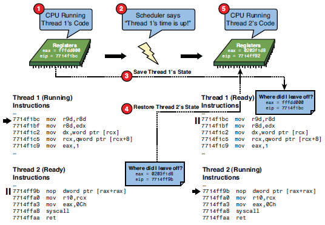
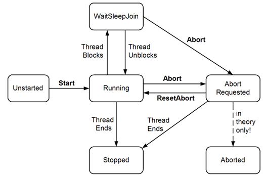

- title : Multithreading
- description : Multithreading in C#
- author : Valentine Radchuk
- theme : league
- transition : default

***

## C# course
#### Lecture 13
# Multithreading in C#

***

## Agenda
- Introduction and Concepts 
- Threads
- Creating and starting threads
- Thread lifecycle
- Error handling
- Thread Pooling
- Memory model for multithreading
- Synchronization concepts
- Immutable objects and synchronization

***

### What is multithreading

Multithreading - parallel execution of code, leveraging threads.

<br/>

C# enables multithreading using following namespace:

	[lang=cs]
	using System.Threading; 

---
### When to parallel?

When multithreading might be useful?

- there are few independent tasks that do not intersect (usually calculation)
- separate heavy calculation from UI (to avoid freezes)
- constantly query external service and notify application if new data arrived
- to avoid stop processing waiting for user's input
- separating processing workflow by threads (collect - filter - process - save)

---
### When not to parallel?

When multithreading might be awkward?

- when number of threads is big enought
- when modules are tightly coupled and there are a lot of commmon data across modules (refactor first)
- when it won't bring any value (switching threads is a heavy operation)

***
###Thread

- a **thread** is an independent execution path, able to run simultaneously with other threads and can be managed independently by a scheduler
- threads might run in parallel on differen physical cores or creatign multicore illusion (preemptive or context switching)

---
###Context switching



---
###Thread vs Process

Do not mix Threads and Process

- Thread - execution path within a process
	- share memory of containing process
	- share resources dedicated for containing process
	- has own stack withing process memory
	- requiere synchronization

<br/>

- Process - is an instance of a program
	- each process has own dedicated memory space
	- few processes might represent the same program
	- syncronization almost not required

<br />

<a href="https://dotnetfiddle.net/zDZ1V2">Example of code with multiple threads</a>

***
###Threads in C#

Threads are represented in C# by class <a href="https://msdn.microsoft.com/en-us/library/system.threading.thread%28v=vs.110%29.aspx">Thread</a>

```cs
	System.Threading.Thread
```
####Constructors:

Run parameterless method in separate thread

```cs
	Thread(ThreadStart)
```

Run method with an object-type parameter in separate thread

```cs
	Thread(ParameterizedThreadStart)
```

---
###Creating and running threads

Thread should be created with an entry point when new thread will start execution.

This entry point is outlined by following delegates:

```cs
	public delegate void ThreadStart();
	public delegate void ParameterizedThreadStart(Object obj);
```

Once thread created it should be run for execution:


```cs
	var thread = new Thread(someEntryPoint);
	thread.Start(); 	
```

<a href="https://dotnetfiddle.net/zDZ1V2">Create thread - demo</a>

***
###Thread lifecycle


  <aside class="notes">
        Oh hey, these are some notes.
  </aside>

---
###Thread lifecycle details


<a href="http://www.codeproject.com/Articles/26675/Beginner-s-Guide-to-Threading-in-NET-Part-of-n">More about multithreading</a>

***
###Stopping and aborting threads
There are a number of ways to stop thread:

- Let thread exits by itself
- Let thread dead by natural causes (exit from entry method)
- Call <a href="https://msdn.microsoft.com/ru-ru/library/ty8d3wta(v=vs.110).aspx">Thread.Abort()</a> method (depricated)
- Call <a href="https://msdn.microsoft.com/ru-ru/library/system.threading.thread.suspend(v=vs.110).aspx">Thread.Suspend()</a> method (depricated)
- Call <a href="https://msdn.microsoft.com/ru-ru/library/system.threading.thread.interrupt(v=vs.110).aspx">Thread.Interrupt()</a> method to exit from SleepWaitJoin state

***
###Thread characteristics

- <a href="http://www.c-sharpcorner.com/uploadfile/40e97e/what-is-foreground-or-background-thread/">background vs foreground threads (IsBackground)</a>
- thread could be named with property Name - <a href="http://www.codeproject.com/KB/cs/MasteringInDebugging/debug43_small.png">example</a>
- thread execution priority (<a href="https://msdn.microsoft.com/ru-ru/library/system.threading.thread.priority(v=vs.110).aspx">Priority</a>)
- state of a thread (<a href="https://msdn.microsoft.com/ru-ru/library/system.threading.thread.threadstate(v=vs.110).aspx">ThreadState</a>)

***
###Error handling

- exception could be cought within a thread (not outside it)
- unhandled exception occured at any thread terminates entire application
- it does not make sense to catch ThreadAbortException (caused by Thread.Abort() method)
- you can catch globally unhandled exception by event <a href="https://msdn.microsoft.com/en-us/library/system.appdomain.unhandledexception%28v=vs.110%29.aspx">AppDomain.CurrentDomain.UnhandledException</a>, however it's impossible to prevent application from closing

***
###Thread pooling
